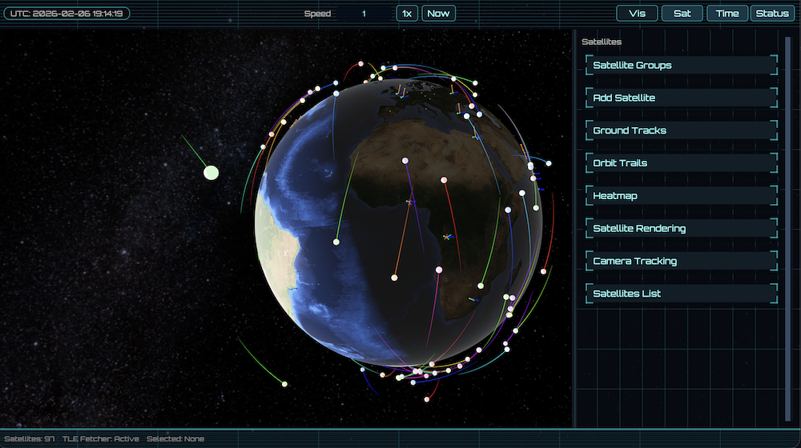

# Bevy Earth

## What is Bevy Earth?

Bevy Earth is an interactive 3D application that lets you explore Earth from space while tracking real satellites as they orbit our planet. Using TLE data from the [CelesTrak](https://celestrak.org) satellite database, you can watch thousands of satellites move in their actual orbits around a beautifully rendered Earth model. Try loading all the Starlink satellites in the Group list for some real fun!

## Why
This is a toy project to help me learn Bevy and Rust, along with a good dose of AI pair programming (thank you Anthropic, Google, xAi and OpenAI).

**What a world we live in!**

## Features

- **Real-time Satellite Tracking**: Watch satellites move in their actual orbits using live TLE (Two-Line Element) data
- **TLE Disk Caching**: Intelligent caching system stores satellite data locally for faster loading and offline access
- **Camera Tracking**: Follow any satellite with smooth camera movement as it orbits Earth
- **Interactive 3D Earth**: Navigate around a detailed Earth model with realistic textures
- **Moon View**: See the Moon with realistic orbital mechanics and the ability to focus the camera on it
- **Launch Tracking**: View upcoming rocket launches with 3D launch pad markers on Earth
- **Space Events**: Stay informed about upcoming space events and missions
- **Satellite Groups**: Browse and select different types of satellites (weather, communication, scientific, etc.)
- **City Visualization**: See major cities marked on the Earth's surface
- **Ground Tracks & Trails**: Visualize satellite ground tracks and orbit trails
- **Time Controls**: Speed up or slow down time to see orbital patterns
- **Satellite Management**: Add, remove, and organize satellites in your view
- **Polished UI**: Resizable panels, top bar quick actions, and a cohesive theme

## Getting Started

1. Install Rust from [rustup.rs](https://rustup.rs/)
2. Clone this repository
3. Run `cargo run` to start the application
4. Use the mouse to navigate around Earth and the UI panel to manage satellites

## Docs

- [Coordinate frames](docs/coordinates.md)

## Controls

- **Mouse**: Rotate and zoom around Earth
- **Top Bar**: Time controls, quick panel toggles, and camera shortcuts
- **Left/Right Panels**: Manage satellite groups, individual satellites, and visualization options
- **Satellite Tracking**: Click any satellite's NORAD ID to start camera tracking
- **Keyboard Shortcuts**:
  - `H`: Toggle left panel (visualization)
  - `J`: Toggle right panel (satellite controls)
  - `K`: Toggle top panel
  - `L`: Toggle bottom panel (status)
  - `V`: Toggle 3D viewport cropping

## Satellite Camera Tracking

The camera tracking feature allows you to follow satellites as they move through their orbits:

1. **Start Tracking**: Click on any satellite's NORAD ID in the satellite list
2. **Visual Indicators**: Tracked satellite shows a 📹 icon and highlighted button
3. **Stop Tracking**: Use the "Stop Tracking" button in the Camera Tracking section or click the NORAD ID again
4. **Configure**: Adjust tracking distance (1-20km) and smoothness in the UI
5. **Switch Targets**: Click another satellite to switch tracking

## Moon View

Bevy Earth includes a realistic 3D moon model:

- **Orbital Mechanics**: The Moon follows realistic orbital calculations around Earth
- **Camera Focus**: Switch camera focus between Earth and Moon using the UI controls
- **Accurate Positioning**: Moon position updates in real-time based on the simulation time

## Launch and Event Tracking

Stay informed about upcoming space activities:

- **Upcoming Launches**: View the next rocket launches with details including launch provider, mission name, and target orbit
- **Launch Pad Markers**: See 3D rocket markers at launch pad locations on Earth with animated pulse effects
- **Space Events**: Browse upcoming space events such as spacecraft arrivals, EVAs, and other significant milestones
- **Launch Library API**: Data is fetched from [The Space Devs Launch Library](https://thespacedevs.com/) and refreshed automatically
- **Interactive Markers**: Click on launch pad markers to view detailed launch information

## TLE Disk Caching

Bevy Earth features an intelligent disk caching system that dramatically improves satellite loading performance:

- **Automatic Caching**: TLE data is automatically cached to disk after the first fetch, eliminating redundant network requests
- **Epoch-Based Validation**: Cached data is validated based on TLE epoch timestamps (default: 7-day expiration)
- **Instant Loading**: Cached satellites load in 1-2ms vs 100-500ms network fetch (50-500x faster)
- **Offline Access**: Recently viewed satellites remain available even without network connectivity
- **Stale Fallback**: If network fails and cached data is expired, the app uses stale cache rather than failing completely
- **Platform Support**: Cross-platform cache directory resolution (macOS, Linux, Windows)
- **Zero Configuration**: Works automatically with sensible defaults, no setup required

**Cache Location:**
- macOS: `~/Library/Caches/bevyearth/tle/`
- Linux: `~/.cache/bevyearth/tle/`
- Windows: `%LOCALAPPDATA%\bevyearth\tle\`

**Performance Impact:**
- 80-90% reduction in Celestrak API requests
- Near-instant satellite loading from cache
- Minimal disk usage (~300-500 bytes per satellite)
- Graceful degradation when offline

## Inspiration 
- https://blog.graysonhead.net/posts/bevy-proc-earth-1
- https://github.com/jan-tennert/solarsim
- https://celestrak.org
