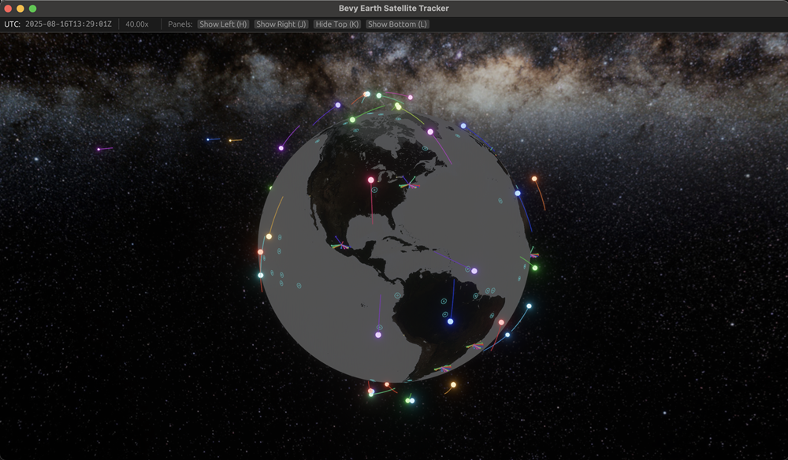

# BevyEarth

An interactive 3D Earth visualization that tracks satellites in real-time.

## What is BevyEarth?

BevyEarth is an interactive 3D application that lets you explore Earth from space while tracking real satellites as they orbit our planet. Using TLE data from satellite tracking database [CelesTrak](https://celestrak.org) , you can watch thousands of satellites move in their actual orbits around a beautifully rendered Earth model.

## Features

- **Real-time Satellite Tracking**: Watch satellites move in their actual orbits using live TLE (Two-Line Element) data
- **Camera Tracking**: Follow any satellite with smooth camera movement as it orbits Earth
- **Interactive 3D Earth**: Navigate around a detailed Earth model with realistic textures
- **Satellite Groups**: Browse and select different types of satellites (weather, communication, scientific, etc.)
- **City Visualization**: See major cities marked on the Earth's surface
- **Coverage Areas**: Visualize satellite coverage footprints
- **Time Controls**: Speed up or slow down time to see orbital patterns
- **Satellite Management**: Add, remove, and organize satellites in your view

## Getting Started

1. Install Rust from [rustup.rs](https://rustup.rs/)
2. Clone this repository
3. Run `cargo run` to start the application
4. Use mouse to navigate around Earth and the UI panel to manage satellites

## Controls

- **Mouse**: Rotate and zoom around Earth
- **UI Panel**: Select satellite groups, manage individual satellites, and control visualization options
- **Satellite Tracking**: Click any satellite's NORAD ID to start camera tracking
- **Keyboard Shortcuts**:
  - `H`: Toggle left panel
  - `J`: Toggle right panel (satellite controls)
  - `K`: Toggle top panel
  - `L`: Toggle bottom panel

## Satellite Camera Tracking

The camera tracking feature allows you to follow satellites as they move through their orbits:

1. **Start Tracking**: Click on any satellite's NORAD ID in the satellite list
2. **Visual Indicators**: Tracked satellites show a 📹 icon and highlighted button
3. **Stop Tracking**: Use the "Stop Tracking" button in the Camera Tracking section
4. **Configure**: Adjust tracking distance (1-20km) and smoothness in the UI
5. **Switch Targets**: Click another satellite to switch tracking

For detailed information, see [SATELLITE_TRACKING.md](SATELLITE_TRACKING.md).

## Inspiration 
- https://blog.graysonhead.net/posts/bevy-proc-earth-1
- https://github.com/jan-tennert/solarsim
- https://celestrak.org
