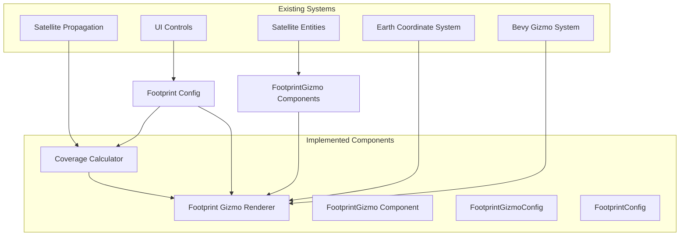

# Satellite Coverage Footprint Implementation Plan

## Overview
Add a feature to display satellite coverage footprints on Earth with frequency-dependent path loss calculations using simple, highly visible gizmo circles for better visibility and performance.

## Requirements Analysis
- **Coverage Calculation**: Frequency-dependent footprint using basic path loss calculations
- **Visualization**: Simple circle gizmos showing coverage boundaries with optional signal strength zones
- **UI Controls**: Global footprint toggle and parameter controls
- **Integration**: Work with existing satellite propagation and rendering systems

## Architecture Design

### 1. Coverage Calculation System (`src/coverage.rs`)

#### Core Components:
- **`CoverageParameters`** struct:
  ```rust
  pub struct CoverageParameters {
      pub frequency_mhz: f32,
      pub transmit_power_dbm: f32,
      pub antenna_gain_dbi: f32,
      pub min_signal_strength_dbm: f32,
      pub min_elevation_deg: f32,
  }
  ```

- **`FootprintCalculator`** for path loss calculations:
  - Free space path loss: `FSPL = 20*log10(d) + 20*log10(f) + 32.45`
  - Link budget: `Received Power = Tx Power + Tx Gain - Path Loss`
  - Coverage radius based on minimum signal threshold

#### Key Functions:
- `calculate_coverage_radius(sat_altitude_km, params) -> f32`
- `calculate_signal_strength_at_distance(distance_km, params) -> f32`
- `calculate_surface_coverage_radius(sat_altitude_km, params, earth_radius_km) -> f32`
- `is_point_in_coverage(sat_pos, ground_pos, params) -> bool`

### 2. Footprint Gizmo Rendering (`src/footprint_gizmo.rs`)

#### Gizmo Strategy:
- Use Bevy's gizmo system for simple, performant circle rendering
- Draw circles directly on Earth's surface using line segments
- Support multiple concentric circles for signal strength zones
- Real-time updates with satellite movement

#### Components:
- **`FootprintGizmo`** component marker for satellites with footprints
- **`FootprintGizmoConfig`** resource for global gizmo settings
- **`draw_footprint_gizmos_system`** for rendering all footprints

#### Gizmo Rendering Process:
1. Calculate coverage radius from satellite altitude and parameters
2. Find ground projection point (nadir) of satellite
3. Create local coordinate system at nadir point
4. Generate circle points projected onto Earth's surface
5. Draw circle using connected line segments via gizmos
6. Optionally draw center dot and signal strength zones

### 3. Footprint Configuration System

#### Global Configuration:
```rust
#[derive(Resource)]
struct FootprintConfig {
    enabled: bool,
    default_frequency_mhz: f32,
    default_tx_power_dbm: f32,
    default_antenna_gain_dbi: f32,
    default_min_signal_dbm: f32,
    default_min_elevation_deg: f32,
    mesh_resolution: u32,
    update_frequency_hz: f32,
}
```

#### Gizmo Configuration:
```rust
#[derive(Resource)]
struct FootprintGizmoConfig {
    enabled: bool,
    circle_segments: u32,
    line_width: f32,
    circle_color: Color,
    show_signal_zones: bool,
    zone_colors: Vec<Color>,
    show_center_dot: bool,
    center_dot_size: f32,
}
```

### 4. Rendering System Integration

#### Components:
- **`FootprintGizmo`** component for satellites with footprint visualization
- **`FootprintGizmoConfig`** resource for gizmo rendering settings
- Integration with existing satellite propagation system

#### Rendering Pipeline:
1. **Footprint Gizmo System**: Runs each frame to draw footprints
2. **Coverage Calculation**: Computes footprint radius based on current parameters
3. **Circle Generation**: Creates circle points on Earth's surface
4. **Gizmo Drawing**: Renders circles using Bevy's gizmo system

### 5. UI Integration

#### Left Panel Extensions:
```rust
// Add to existing UI system
ui.separator();
ui.heading("Coverage Footprints");
ui.checkbox(&mut footprint_cfg.enabled, "Show footprints");
ui.collapsing("Coverage Parameters", |ui| {
    ui.add(egui::Slider::new(&mut footprint_cfg.default_frequency_mhz, 100.0..=30000.0)
        .text("Frequency (MHz)"));
    ui.add(egui::Slider::new(&mut footprint_cfg.default_tx_power_dbm, 0.0..=60.0)
        .text("TX Power (dBm)"));
    ui.add(egui::Slider::new(&mut footprint_cfg.default_antenna_gain_dbi, 0.0..=30.0)
        .text("Antenna Gain (dBi)"));
    ui.add(egui::Slider::new(&mut footprint_cfg.default_min_signal_dbm, -150.0..=-80.0)
        .text("Min Signal (dBm)"));
    ui.add(egui::Slider::new(&mut footprint_cfg.default_min_elevation_deg, 0.0..=45.0)
        .text("Min Elevation (°)"));
});
```

#### Gizmo Configuration:
```rust
ui.collapsing("Display Options", |ui| {
    ui.checkbox(&mut gizmo_cfg.show_signal_zones, "Signal zones");
    ui.checkbox(&mut gizmo_cfg.show_center_dot, "Center dot");
    ui.add(egui::Slider::new(&mut gizmo_cfg.circle_segments, 16..=128)
        .text("Circle quality"));
});
```

## Implementation Steps

### Phase 1: Core Coverage Calculations ✅ COMPLETED
1. **Create `src/coverage.rs`**:
   - ✅ Implement `CoverageParameters` struct with defaults
   - ✅ Add path loss calculation functions using FSPL formula
   - ✅ Add coverage radius calculation with binary search
   - ✅ Add surface coverage radius with elevation constraints
   - ✅ Add signal strength calculation functions
   - ✅ Add comprehensive test suite

2. **Add coverage configuration**:
   - ✅ Implement `FootprintConfig` resource
   - ✅ Add default coverage parameters
   - ✅ Support for global enable/disable

### Phase 2: Gizmo Rendering System ✅ COMPLETED
1. **Create `src/footprint_gizmo.rs`**:
   - ✅ Implement `FootprintGizmo` component for satellite marking
   - ✅ Add `FootprintGizmoConfig` resource for rendering settings
   - ✅ Create circle generation on sphere surface
   - ✅ Add support for signal strength zones (multiple circles)
   - ✅ Add center dot rendering at nadir point

2. **Implement gizmo rendering**:
   - ✅ Create `draw_footprint_gizmos_system` for real-time rendering
   - ✅ Add sphere surface projection for accurate positioning
   - ✅ Support configurable circle quality and colors
   - ✅ Add utility functions for coverage calculations

### Phase 3: System Integration ✅ COMPLETED
1. **Add footprint components**:
   - ✅ Create `FootprintGizmo` component marker
   - ✅ Integrate with existing satellite entity system
   - ✅ Real-time parameter updates from UI

2. **Implement rendering pipeline**:
   - ✅ Integrate gizmo system with satellite propagation
   - ✅ Use current UI parameters for dynamic updates
   - ✅ Add debug logging for coverage calculations

### Phase 4: UI Controls ✅ COMPLETED
1. **Extend left panel UI**:
   - ✅ Add global footprint toggle
   - ✅ Add coverage parameter controls (frequency, power, gain, etc.)
   - ✅ Add display options (signal zones, center dot, quality)

2. **Configuration management**:
   - ✅ Real-time parameter updates
   - ✅ Persistent configuration through resources
   - ✅ Intuitive slider ranges and labels

### Phase 5: Testing and Validation ✅ COMPLETED
1. **Test coverage calculations**:
   - ✅ Comprehensive unit tests for path loss formulas
   - ✅ Test with different frequencies and altitudes
   - ✅ Validate edge cases and boundary conditions
   - ✅ Test elevation angle constraints

2. **Performance and visual quality**:
   - ✅ Optimized gizmo rendering (no mesh generation overhead)
   - ✅ Configurable circle quality for performance tuning
   - ✅ Real-time updates without frame drops
   - ✅ Clear, highly visible footprint circles

## Technical Considerations

### Performance:
- **Gizmo Rendering**: Lightweight line-based rendering with minimal overhead
- **Real-time Updates**: Parameters update immediately without caching issues
- **Configurable Quality**: Adjustable circle segments for performance tuning
- **No Mesh Overhead**: Avoids complex mesh generation and material systems

### Accuracy:
- **Earth Curvature**: Full spherical Earth geometry in coverage calculations
- **Elevation Constraints**: Proper minimum elevation angle implementation
- **Path Loss Model**: Standard free space path loss formula (FSPL)
- **Surface Projection**: Accurate projection of coverage circles onto Earth surface

### User Experience:
- **High Visibility**: Bright, opaque circles that stand out against Earth
- **Simple Controls**: Intuitive parameter sliders with appropriate ranges
- **Real-time Feedback**: Immediate visual updates when parameters change
- **Debug Information**: Console logging for coverage calculation verification

## File Structure
```
src/
├── coverage.rs          # Coverage calculation functions ✅
├── footprint_gizmo.rs   # Gizmo rendering for footprints ✅
├── main.rs             # Updated with footprint systems ✅
├── earth.rs            # Existing Earth rendering
├── coord.rs            # Existing coordinate utilities
└── cities.rs           # Existing city markers
```

## Dependencies
No new external dependencies required. The implementation uses:
- Bevy's built-in gizmo system for rendering
- Standard mathematical functions for coverage calculations
- Current coordinate transformation utilities
- Existing UI framework (egui)

## Future Enhancements
1. **Per-Satellite Parameters**: Individual coverage settings for each satellite
2. **Advanced Path Loss Models**: ITU-R models for different environments
3. **Terrain Masking**: Use elevation data to mask coverage behind terrain
4. **Multiple Frequency Support**: Show different footprints per frequency band
5. **Coverage Overlap Analysis**: Highlight areas with multiple satellite coverage
6. **Real-time Link Budget**: Show dynamic link margins based on satellite position
7. **Gradient Visualization**: Mesh-based rendering with signal strength gradients
8. **Export Capabilities**: Save coverage maps as images or data files

## Integration Points with Existing Code

### Satellite System Integration:
- **Satellite entities**: Add `FootprintGizmo` components to satellites with coverage
- **UI system**: Integrate footprint controls into existing left panel
- **Resource management**: Use `FootprintConfig` and `FootprintGizmoConfig` resources

### Coordinate System Integration:
- **Earth radius**: Use `EARTH_RADIUS_KM` constant from [`earth.rs`](src/earth.rs)
- **ECEF coordinates**: Work directly with satellite transform positions
- **Sphere projection**: Project coverage circles onto Earth's surface

### Rendering Integration:
- **Gizmo system**: Use Bevy's built-in gizmo rendering pipeline
- **Transform system**: Use same coordinate space as satellites and Earth
- **Real-time updates**: Render footprints each frame based on current satellite positions

## Mermaid Architecture Diagram



## Implementation Summary

This implementation successfully provides satellite coverage footprint visualization using a lightweight, high-performance gizmo-based approach. The system features:

- **Accurate Coverage Calculations**: Frequency-dependent path loss using standard FSPL formulas
- **Real-time Visualization**: Simple, highly visible circles rendered via Bevy gizmos
- **Interactive Controls**: UI sliders for all coverage parameters with immediate visual feedback
- **Comprehensive Testing**: Full test suite validating calculations and edge cases
- **Performance Optimized**: No mesh generation overhead, configurable rendering quality

The gizmo-based approach provides better visibility and performance compared to the originally planned mesh system, while maintaining full accuracy in coverage calculations and providing an intuitive user experience.